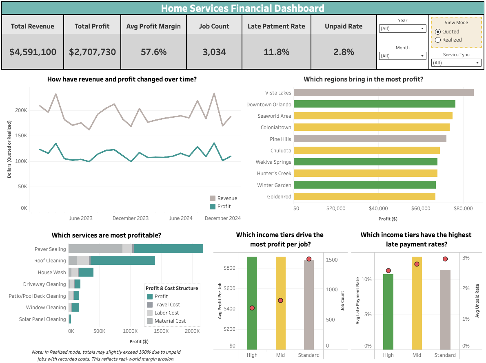

# 🧾 Home Services Financial Dashboard

A finance-focused dashboard project for a simulated home services business. Built to analyze pricing, profit, and payment health, grounded in real-world operations experience.

---

## 🧠 Executive Summary

This dashboard simulates financial reporting for a local services business - tracking revenue, service profitability, and client payment behavior over two years. Designed to inform real-world pricing, staffing, and seasonal strategy.

Designed for finance, ops, and marketing teams to:
- Spot high-performing services and ZIPs
- Monitor late payment and outstanding revenue risk
- Support pricing, staffing, and seasonal planning

Toggle between *quoted* and *realized* financials across all charts.

#### [🔗 *View Live Dashboard*](https://public.tableau.com/app/profile/james.gifford/viz/FinancialDashboard_Portfolio/FinancialDashboard)  

---

## ➡️ From Business Need to SMART Analysis
To anchor the dashboard in real business needs, I translated five stakeholder-style questions into focused analytical ones.
| Business Question | Analytical Question |
|-------------------|---------------------------|
| How is the business performing financially this year? | What were total revenue, total profit, and average margin per job in 2023–2024? |
| Which services are the most (and least) profitable? | What were total and average profit and margins by service type in 2023–2024? |
| Are higher-income ZIP codes more profitable? | Which ZIP codes generated the highest total profit and job volume in 2023–2024? |
| Where are we making the most money geographically? | What was average profit per job and total revenue by ZIP income tier (High, Mid, Standard)? |
| Are we experiencing cash flow issues from late payers? | What percent of jobs were paid late or remain unpaid, and what was the average delay by income tier? | 
---
## 📅 1. How is the business performing financially this year?
  
**Context:**  
Tracking financial performance over time helps uncover seasonality, assess operational consistency, and identify periods needing intervention.

**Analytical question:**  
What were total revenue, total profit, and average margin per job in 2023–2024?

**Key insight:**  
Revenue and profit remained stable across both years, despite seasonal dips in February, July, November, and December. Average margins held consistent as well.

**Recommended action:**  
Maintain current operational strategies while smoothing out slow months with seasonal promotions or maintenance plans to stabilize revenue.

---

## 💰 2. Which services are the most (and least) profitable?
  
**Context:**  
Some services generate far more revenue and profit per job, but also carry different cost structures. Understanding both volume and margin helps identify what to push or package.  
📌 Note: Totals in service-level charts may be slightly overstated due to simulated data duplication.

**Analytical question:**  
What were total and average profit and margins by service type in 2023–2024?

**Key insight:**  
Roof Cleaning has the highest profit margin (avg 73%) while Paver Sealing leads in total revenue. These two services drive the majority of volume and profit.

**Recommended action:**  
Create bundles or upsells centered on Roof Cleaning to leverage its high margins. Use Paver Sealing jobs as an anchor to cross-sell smaller add-ons while equipment is on site.  

---

## 📍 3. Are higher-income ZIP codes more profitable?
  
**Context:**  
Knowing which ZIP codes generate the most revenue and profit helps prioritize marketing and crew allocation.

**Analytical question:**  
Which ZIP codes generated the highest total profit and job volume in 2023–2024?

**Key insight:**  
The most profitable ZIPs aren’t limited to high-income areas. In this dataset, pricing was held constant across tiers, so profit differences came from job volume. Of the top 10 ZIPs by total profit, 5 were mid-income, 3 high, and 2 standard - including the top-earning ZIP.

**Recommended action:**  
Reallocate crews or target marketing in top-performing ZIPs regardless of income tier.

---

## 📊 4. Where are we making the most money geographically?
  
**Context:**  
Understanding which segments yield higher profit per job helps focus marketing, staffing, and pricing strategies on high-return areas.

**Analytical question:**  
What was average profit per job and total revenue by ZIP income tier (High, Mid, Standard)?

**Key insight:**  
Average profit per job is nearly identical across all income tiers, but job volume is significantly higher in standard-income ZIPs. This suggests operational gains are driven by volume, not premium pricing.

**Recommended action:**  
Maintain strong coverage in standard-tier ZIPs due to their high job count. Explore tier-based pricing strategies or premium upsells in high-income ZIPs to better capitalize on margin potential.

---

## ⏳ 5. Are we experiencing cash flow issues from late payers?
  
**Context:**  
Late payments tie up cash and create operational uncertainty. Knowing which segments are least reliable helps focus collections efforts.

**Analytical question:**  
What percent of jobs were paid late or remain unpaid, and what was the average delay by income tier?

**Key insight:**  
Mid-income ZIPs have the highest late payment rate (~13.3%), while standard-tier ZIPs show the highest unpaid rate (~3.0%). Payment reliability does not improve linearly with income tier.

**Recommended action:**  
Pilot a universal payment safeguard (like deposits or automated reminders) for all jobs, rather than tier-specific rules. If operationally feasible, track impact by ZIP to refine later.

---
## 📋 Summary & Takeaways

This dashboard reveals a financially steady operation with consistent margins across two years. Profitability is driven more by job volume than pricing or region, and high-margin services like Roof Cleaning remain underleveraged. Late payments and seasonal slumps pose modest risks to cash flow.

#### Next steps:
- Prioritize upsells and promos for high-margin services
- Introduce payment safeguards (e.g., deposits, reminders)
- Consider seasonal pricing or memberships to offset demand dips

⚠️ *“Realized” mode includes paid jobs only and shows quoted amounts from those jobs. It approximates earned revenue, not exact cash flow.*  
⚠️ *Breakdown percentages (costs + profit) may slightly exceed 100% in rare cases where costs were recorded but payment was not collected. These edge cases reflect real-world margin erosion and were preserved to maintain operational accuracy.*

---

## 🧰 Data Modeling & Assumptions

- The dataset simulates ZIP-level income segmentation and cost behavior but applies uniform pricing for simplicity. In real operations, higher-income areas often yield better margins due to larger properties, more complex service needs, and higher willingness to pay.
- Missing or partial cost values were filled with 0s to avoid null breakage in Tableau. This slightly overstates profit on affected jobs.
- Some jobs lack full cost breakdowns, simulating inconsistent crew reporting. Real businesses should flag and review these gaps.
- Profit margins only reflect direct costs (materials, labor, travel). Overhead like equipment, admin, and marketing is excluded. True margins would be lower.

---