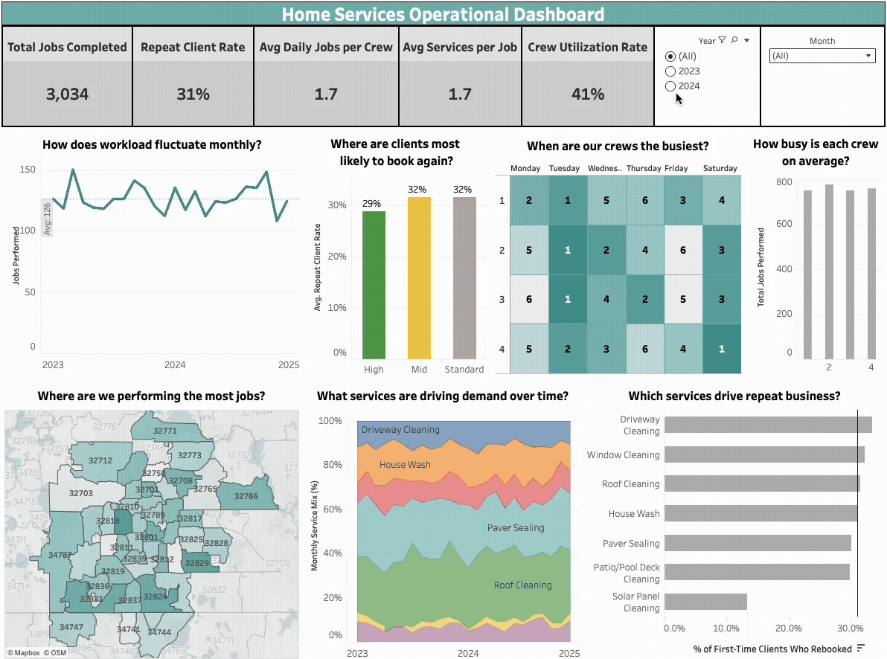
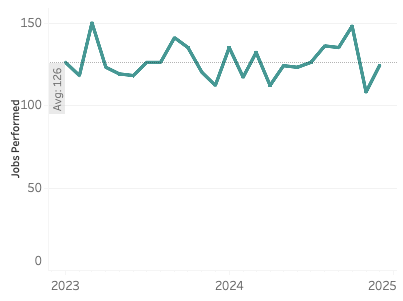
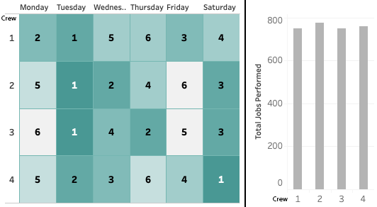
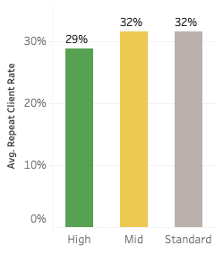
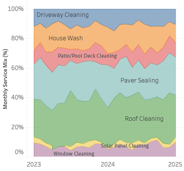
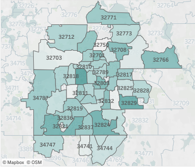
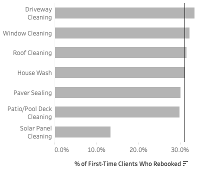

# 🧾 Home Services Operational Dashboard  
  
A performance monitoring dashboard for a simulated home services company. Focused on crew efficiency, service demand, and repeat client behavior, modeled after real-world field operations.

---

## 🧠 Executive Summary  
This dashboard tracks operational health across two years of jobs. It helps service managers and ops leads answer key questions about workload patterns, crew utilization, client retention, and regional demand.

Built for operations and scheduling teams to:
- Monitor job volume and seasonal shifts in demand
- Identify inefficiencies in crew distribution and daily load
- Identify high-retention services and client types
- Track geographic concentration to inform staffing and outreach

#### [🔗 *View Live Dashboard*](https://public.tableau.com/app/profile/james.gifford/viz/OperationalDashboard_Portfolio/OperationalDashboard)  

---

## ➡️ From Business Need to SMART Analysis  

| **Business Question**  | **Analytical Question** |
|-------------------|--------------------------|
| How much work are we doing and how has demand changed over time? | What’s the total job volume over time, by service type or ZIP tier?                |
| Are we operating efficiently with our crews?           | What’s the average number of jobs per crew per day, and how does it vary by weekday?          |
| Are customers coming back for more work?               | What percent of clients booked more than once, and how does this vary by income tier?         |
| What kinds of services are most in demand?             | What’s the mix of service types over time? Are bundling patterns emerging?                    |
| Which regions drive the most operational volume?       | What’s total job count by ZIP code and income tier?                                                |
| Which services are most likely to bring clients back?  | What % of clients book again after specific services?                                         |

---
## 📦 1. How much work are we doing, and how has demand changed over time?
  
**Context:**  
Understanding total job volume over time helps assess growth, seasonality, and operational load.

**Analytical question:**  
What’s the total job volume over time, broken out by service type or ZIP income tier?

**Key insight:**  
Monthly job volume averaged 126 and remained steady across both years, with modest dips in the winter months. Demand is predictable and shows no major volatility.

**Recommended action:**  
Continue current marketing and booking practices. Consider layering in seasonal promos or maintenance reminders to fill winter slowdowns.

---

## 🧑‍🔧 2. Are we operating efficiently with our crews?
  
**Context:**  
Understanding crew scheduling patterns helps uncover underused days and workload imbalances. Ranking the busiest day for each crew reveals whether scheduling is optimized or overly concentrated.

**Analytical question:**  
What’s the average number of jobs per crew per day, and how does it vary by weekday?

**Key insight:**  
Crew utilization is modest overall (41%), with most crews averaging fewer than two jobs per day. Tuesdays and Saturdays are slightly busier, while Fridays are underused across most teams. Volume is evenly distributed, suggesting scheduling (not workload) is the main constraint.

**Recommended action:**  
- Smooth demand by offering Friday scheduling discounts  
- Rebalance internal routing or booking logic to fill low-demand days  
- Set baseline daily job targets to improve planning and accountability

---

## 🔁 3. Are customers coming back for more work?
  
**Context:**  
Repeat clients are a strong signal of satisfaction and retention. Understanding where repeat rates are strongest can inform both targeting and follow-up strategies.

**Analytical question:**  
What percent of clients booked more than once, and how does this vary by ZIP income tier?

**Key insight:**  
Overall repeat client rate is 31%, with slightly lower rates in high-income ZIPs (29%) and slightly higher in mid and standard tiers (32%). The differences are modest, but suggest more reliable long-term value outside of high-tier regions.

**Recommended action:**  
Send a brief follow-up survey to clients who don’t rebook, especially in high-income ZIPs. Use responses to uncover friction points and improve retention.

---

## 🧼 4. What kinds of services are most in demand?
  
**Context:**  
Understanding service mix over time helps guide marketing, crew specialization, and upsell planning.

**Analytical question:**  
What’s the mix of service types over time? Are bundling patterns emerging?

**Key insight:**  
Roof Cleaning and Paver Sealing consistently make up about half of all monthly jobs, with Driveway Cleaning and House Wash also showing steady demand. Lower-volume services like Window, Solar Panel, and Patio/Pool Deck Cleaning remain niche but stable.

**Recommended action:**  
Ensure staffing is aligned with core service demand. Use high-frequency jobs as anchors to upsell lower-volume services during the same visit.

---

## 🗺 5. Which regions drive the most operational volume?
  
**Context:**  
Mapping job distribution helps evaluate crew routing, coverage gaps, and where to focus local outreach.

**Analytical question:**  
What’s total job count by ZIP code and income tier?

**Key insight:**  
Job volume is well distributed across the greater Orlando area, with no extreme outliers or unreachable ZIPs. High-volume ZIPs span multiple income tiers and are clustered centrally, indicating a naturally efficient service footprint.

**Recommended action:**  
Maintain current geographic coverage - no changes needed.

---

## 🔁 6. Which services are most likely to bring clients back?
  
**Context:**  
Not all services have the same long-term value. Understanding which ones lead to repeat bookings helps guide marketing offers, service bundling, and retention strategy.

**Analytical question:**  
What percent of first-time clients rebook after each initial service?

**Key insight:**  
Lower-cost services like Driveway Cleaning (33.4%) and Window Cleaning (32.3%) lead to the highest repeat rates. These services are likely entry points, getting clients in the door, delivering a positive experience, and building trust for future bookings.

**Recommended action:**  
Position these services as onboarding tools for new customers. Offer first-time discounts or seasonal promotions to drive trial, then follow up with cross-sell campaigns to higher-value services.

## 📋 Summary & Takeaways

This dashboard surfaces a steady and predictable operational environment. Job demand holds firm across seasons, crew capacity is underutilized, and repeat business represents a key growth lever. No major structural issues exist, but several optimization levers remain.

#### Next steps:
- Boost Friday scheduling through promos or routing tweaks
- Increase average jobs per crew to raise efficiency
- Use entry-level services to convert more first-time clients
- Strengthen follow-up touchpoints in high-income ZIPs where repeat rates lag

## 🧰 Data Modeling & Assumptions
- The dataset simulates job-level operational data for a regional home services business, including service type, ZIP code, client ID, and crew assignment.
-Repeat status was determined using unique client IDs and counting distinct job records per client.
- “Crew utilization” is calculated as average jobs per crew per active day. Crews are assumed to be available every scheduled day.
- Repeat business by service type is based on clients whose first job was that service, and whether they booked again in a separate visit.
- Income tiers by ZIP are based on estimated census data.
- Some records have partial or missing service data, simulating inconsistent crew or admin tracking. Real businesses should flag these to improve reporting compliance.